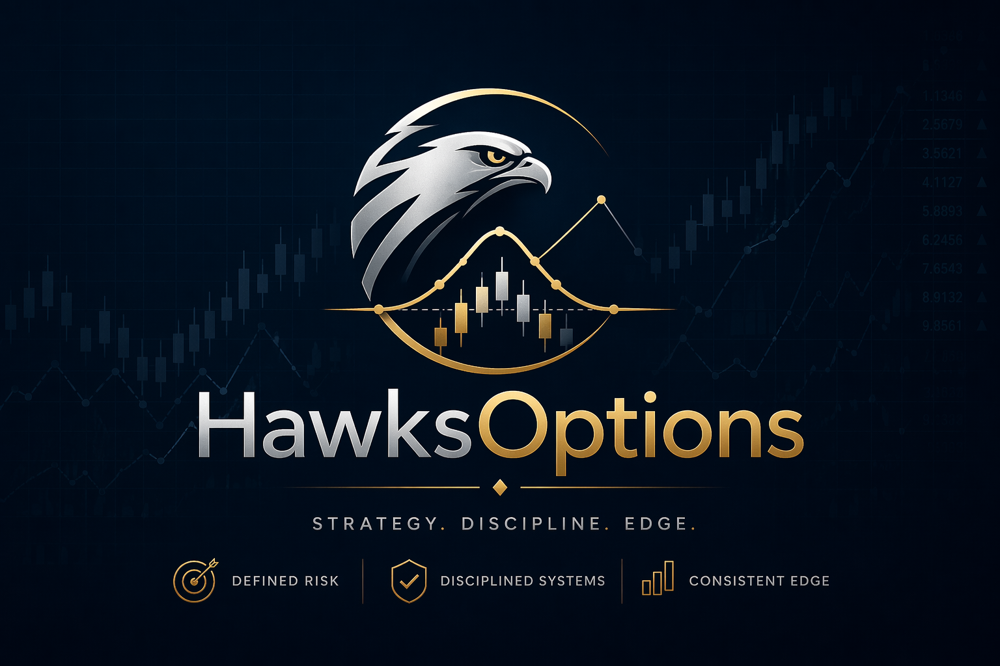

# HawksOptions



HawksOptions is a separate options-native trading system built from
`options_trader_spec.md`. It keeps the operational shape of `HawksTrade`
without sharing runtime state or mutating the reference repo.

## What It Does

- Trades defined-risk options structures only
- Enforces portfolio max-loss limits before every order
- Tracks IV rank, Greeks, earnings blackout windows, and ex-dividend risk
- Ships with a read-only FastAPI dashboard and Linux/systemd deployment assets
- Includes a deterministic sample-data mode so scans, tests, and the bundled
  backtest run without live credentials

## Repository Layout

```text
HawksOptions/
├── assets/                  # branding and visual assets
├── config/                  # config.yaml, .env.example, underlyings.yaml
├── core/                    # options primitives, risk engine, trade logging
├── strategies/              # CSP, covered call, vertical spread, iron condor
├── ai/                      # veto-only AI helpers (optional)
├── scheduler/               # scan, risk checks, roll checks, backtests
├── dashboard/               # read-only FastAPI dashboard
├── cloud-setup/             # EC2/systemd/dashboard deployment guides
├── scripts/                 # health checks, secrets, systemd diagnostics
└── tests/                   # unittest coverage for core scheduler logic
```

## Quick Start

```bash
cd /Users/arunbabuchandrababu/Desktop/AIPROJECTS/HawksOptions
python3 -m venv .venv
. .venv/bin/activate
pip install -r requirements.txt
pip install -r requirements-dashboard.txt
cp config/.env.example config/.env
python3 -m unittest discover -v
python3 scheduler/run_backtest.py --days 30 --fund 10000
python3 scheduler/run_scan.py --dry-run
```

The default config uses sample market data so the system stays runnable before
real Alpaca keys are added.

## Safety Defaults

- `mode: paper`
- defined-risk strategies only
- no 0-DTE or 1-DTE entries
- max single-position risk capped at 5% of equity
- max portfolio defined-risk capped at 20% of equity
- earnings blackout and ex-dividend protection enabled

## Dashboard

The dashboard remains read-only. It exposes:

- account and buying-power summary
- daily-loss headroom
- open strategy aggregates
- portfolio Greeks
- IV rank heatmap
- earnings calendar and health state

See [cloud-setup/dashboard-setup.md](/Users/arunbabuchandrababu/Desktop/AIPROJECTS/HawksOptions/cloud-setup/dashboard-setup.md)
for the deployment pattern.

## Validation

Before publishing or deploying:

```bash
python3 -m unittest discover -v
python3 -W error::DeprecationWarning -m unittest discover
python3 -m compileall core strategies scheduler ai tests dashboard
python3 scheduler/run_backtest.py --days 30 --fund 10000
python3 scheduler/run_scan.py --dry-run
python3 scheduler/run_risk_check.py --dry-run
python3 scheduler/run_eod_report.py --dry-run
```

## Status

This repo implements the phase-1 through phase-3 architecture from the spec,
with optional AI components left veto-only and disabled by default.
